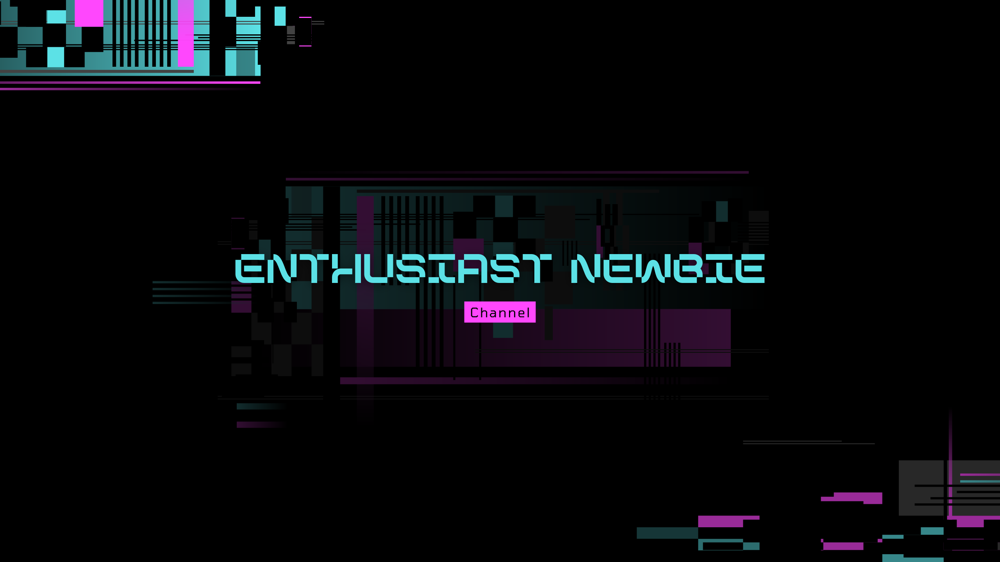

# 👋 Ciao, sono Enthusiast Newbie!
**Appassionato di Tecnologia | Linux Explorer | Content Creator**

---

### 🚀 Cosa Faccio
Sperimento, cerco di imparare qualcosa di nuovo ogni giorno... e condivido il mio punto di vista sul mondo Linux e tech.

---

### 🛠️ La mia Cassetta degli Attrezzi
Ecco cosa sto usando, studiando o torturando in questo periodo:

| 🐧 OS & Distros | 💻 Tools & Terminal | 🎬 Content Creation |
| :---: | :---: | :---: |
|  |  |  |
|  |  |  |
|  |  |  |

---

